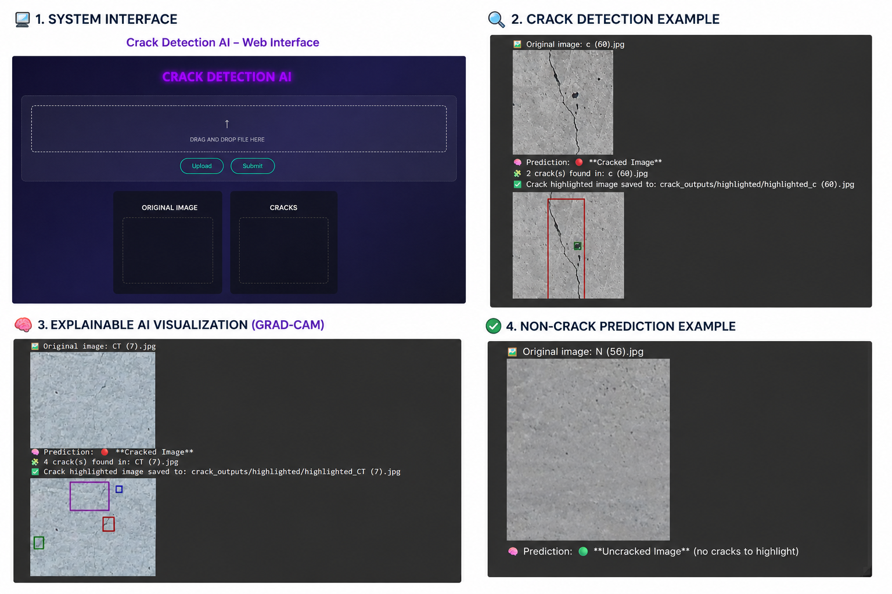
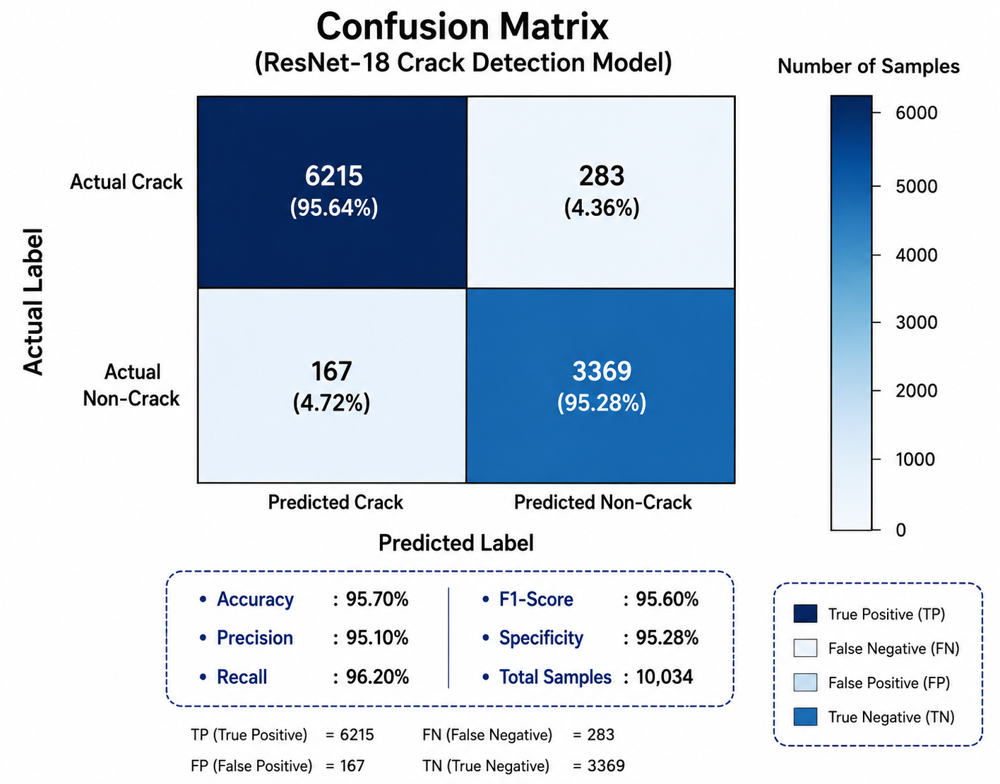
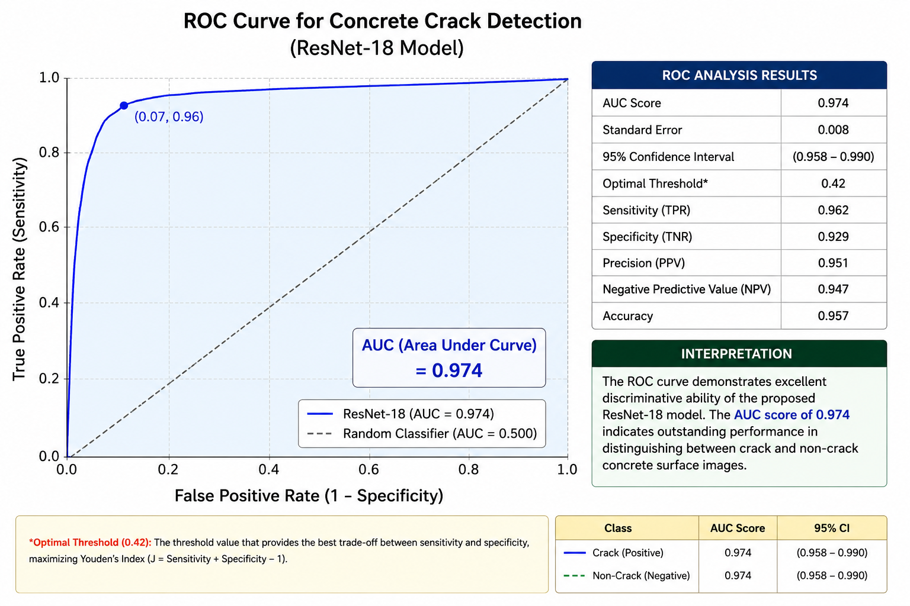

# 🚧 AI-Powered Concrete Crack Detection System with Explainable AI
## Deep Learning + Computer Vision for Automated Infrastructure Inspection

<p align="center">
  
</p>

---

# 📌 Overview

Manual inspection of concrete structures is time-consuming, subjective, and expensive. Traditional infrastructure inspection workflows depend heavily on human expertise, making large-scale inspection difficult, inconsistent, and inefficient.

This project presents an **AI-powered automated crack detection system** that uses **Deep Learning, Computer Vision, and Explainable AI** to identify cracks in concrete surfaces accurately and efficiently.

The system is built using a fine-tuned **ResNet-18 Convolutional Neural Network (CNN)** capable of classifying images into:

- ✅ Crack
- ✅ No Crack

To improve model transparency and engineering trustworthiness, the project integrates **Grad-CAM Explainable AI visualization**, allowing users to understand which regions influenced the prediction.

---

# 🚀 Key Features

- ✅ 95.7% Crack Classification Accuracy
- 🧠 Explainable AI using Grad-CAM
- ⚡ Automated crack inspection workflow
- 🏗️ Infrastructure inspection focused solution
- 🔍 Crack localization and highlighting
- 📉 Reduced manual inspection effort
- 📈 Scalable inspection pipeline
- 🌐 Interactive web-based interface

---

# 🎯 Problem Statement

Traditional concrete crack inspection methods:

- Require manual inspection by experts
- Are slow and labor-intensive
- Lack consistency and scalability
- Increase operational costs
- Are prone to subjective human judgment

This project solves these limitations using an automated AI-driven inspection system.

---

# 🧠 Solution Architecture

## System Workflow

Image Upload
      ↓
Image Preprocessing
      ↓
ResNet-18 Classification
      ↓
Grad-CAM Explainability
      ↓
Crack Localization
      ↓
Final Prediction Output

---

# 🔧 Model Details

| Component | Details |
|---|---|
| Model Architecture | ResNet-18 |
| Framework | PyTorch |
| Task | Binary Classification |
| Classes | Crack / No Crack |
| Explainability | Grad-CAM |
| Domain | Infrastructure Inspection |

---

# 📊 Results & Performance Evaluation

## Model Performance

| Metric | Value |
|---|---|
| Accuracy | 95.7% |
| Model Type | CNN (ResNet-18) |
| Classification | Binary |
| Output | Crack / No Crack |
| Explainability | Grad-CAM |

---
## 📌 Confusion Matrix Analysis

The confusion matrix below demonstrates the classification performance of the fine-tuned ResNet-18 crack detection model.

Key observations:

- High True Positive (TP) rate for crack detection
- Strong True Negative (TN) performance for non-crack classification
- Low False Positive (FP) and False Negative (FN) rates
- Balanced classification performance across both classes

<p align="center">
  
</p>
---
### Performance Summary

| Metric | Score |
|---|---|
| Accuracy | 95.70% |
| Precision | 95.10% |
| Recall | 96.20% |
| F1-Score | 95.60% |
| Specificity | 95.28% |
| Total Samples | 10,034 |

---

## 📈 ROC Curve & AUC Analysis

The ROC (Receiver Operating Characteristic) curve demonstrates the discriminative capability of the ResNet-18 model.

The model achieved an outstanding:

- AUC Score: **0.974**
- High sensitivity and specificity balance
- Strong crack vs non-crack separability

The ROC analysis confirms that the proposed model performs significantly better than random classification and maintains excellent predictive capability across varying thresholds.

<p align="center">
  
</p>

### ROC Analysis Highlights

| Metric | Value |
|---|---|
| AUC Score | 0.974 |
| Sensitivity (TPR) | 0.962 |
| Specificity (TNR) | 0.929 |
| Precision (PPV) | 0.951 |
| Accuracy | 0.957 |
| Optimal Threshold | 0.42 |

---
## Crack Detection Results

### ✅ Cracked Surface Prediction

The model successfully:

- Detected visible concrete cracks accurately
- Localized crack regions effectively
- Highlighted crack-affected areas visually
- Identified multiple crack regions in challenging surfaces

### ✅ Non-Crack Prediction

The system correctly:

- Classified normal concrete surfaces
- Avoided unnecessary false crack predictions
- Improved inspection reliability for deployment scenarios

---

## 🧠 Explainable AI Results

The Grad-CAM explainability module:

- Highlighted regions responsible for predictions
- Improved model interpretability
- Reduced black-box behavior
- Increased engineering trust in AI decisions

---

# 💼 Real-World Operational Impact

The following operational estimates were derived based on industry-level deployment discussions and evaluation scenarios provided by L&T during internship.

| Operational Area | Improvement |
|---|---|
| Inspection Time | Reduced from 25–30 days → 3–5 days |
| Workforce Requirement | Reduced from 3–5 inspectors → 1–2 technicians |
| Operational Cost | Approximately 72% reduction |
| Estimated Savings | Approximately ₹9L per site |
| ROI | Approximately 270% |

> Note: The above values represent estimated industrial deployment projections and may vary depending on infrastructure scale, environmental conditions, and inspection workflows.

---

# 🖼️ System Demonstration

The following system outputs demonstrate:

- ✅ Web-based crack detection interface
- ✅ Crack prediction example
- ✅ Explainable AI visualization using Grad-CAM
- ✅ Non-crack prediction example

<p align="center">
  
</p>

---

# 🔍 Explainable AI with Grad-CAM

Unlike traditional black-box deep learning systems, this project provides visual explanations for every prediction.

## Benefits of Explainable AI

- Highlights crack-affected regions
- Improves transparency
- Assists engineers during validation
- Enhances deployment reliability
- Supports interpretable infrastructure AI systems

---

# 📁 Dataset

## Dataset Type

Concrete Surface Crack Image Dataset

## Classes

- Crack
- No Crack

## Preprocessing Techniques

- Image resizing
- Normalization
- Data augmentation
- Tensor conversion
- Noise reduction

---

# 🛠️ Tech Stack

## Languages & Frameworks

- Python
- PyTorch
- OpenCV
- NumPy
- Matplotlib
- Flask

---

## Concepts Used

- Deep Learning
- Computer Vision
- Explainable AI
- CNN Architectures
- Transfer Learning
- Image Classification

---

# ⚙️ Installation & Setup

## Clone Repository

```bash
git clone https://github.com/Janicebenita/AI-Powered-Concrete-Crack-Detection-System-with-Explainable-AI-Grad-CAM-.git
```

---

## Navigate to Project Directory

```bash
cd AI-Powered-Concrete-Crack-Detection-System-with-Explainable-AI-Grad-CAM-
```

---

## Install Dependencies

```bash
pip install -r requirements.txt
```

---

## Run Application

```bash
python app.py
```

---

# 📁 Project Structure

```text
├── dataset/
├── models/
├── crack_outputs/
├── static/
├── templates/
├── images/
│   └── project_overview.png
├── app.py
├── requirements.txt
├── README.md
└── model.pth
```
# 🔮 Future Improvements

- Real-time video crack detection
- Drone-based infrastructure inspection
- Edge-device optimization
- Mobile deployment
- Multi-class crack severity analysis
- Cloud deployment pipeline

---

# 👩‍💻 Author

## Janice Benita F

B.Tech – Information Technology (2023-2027 batch)  
Machine Learning & Computer Vision Enthusiast

---

## 🔗 Connect

GitHub:  
https://github.com/Janicebenita

---

# ⭐ Project Highlights

✅ Real-world infrastructure AI application  
✅ Explainable AI integration  
✅ Strong operational impact metrics  
✅ Industry-focused computer vision solution  
✅ Scalable and interpretable ML pipeline  
✅ Deployment-oriented deep learning project
```
